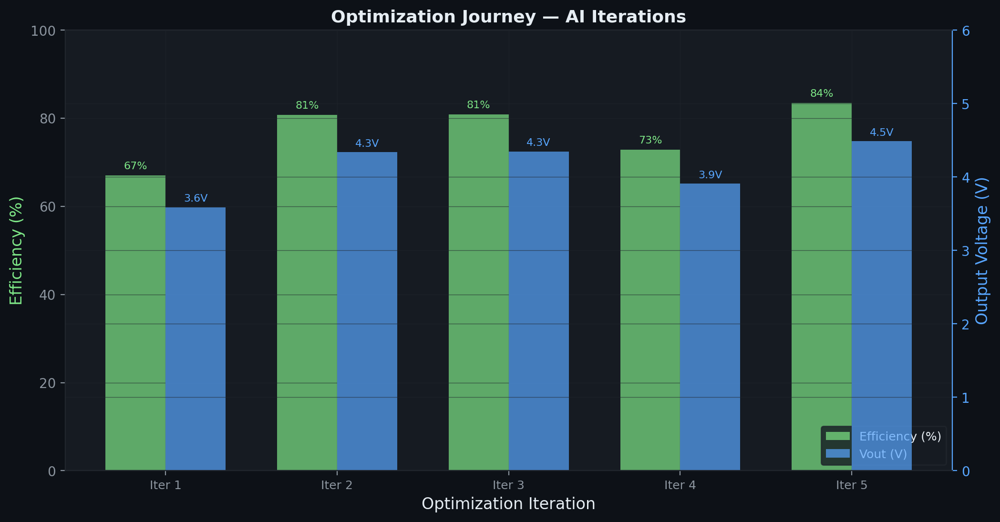
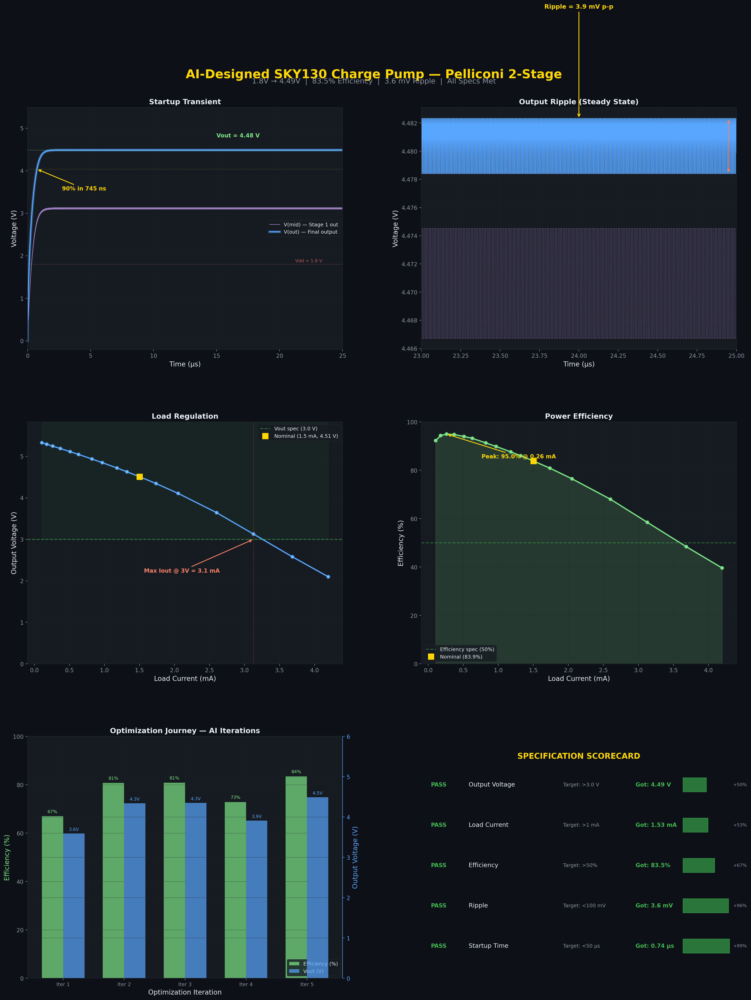
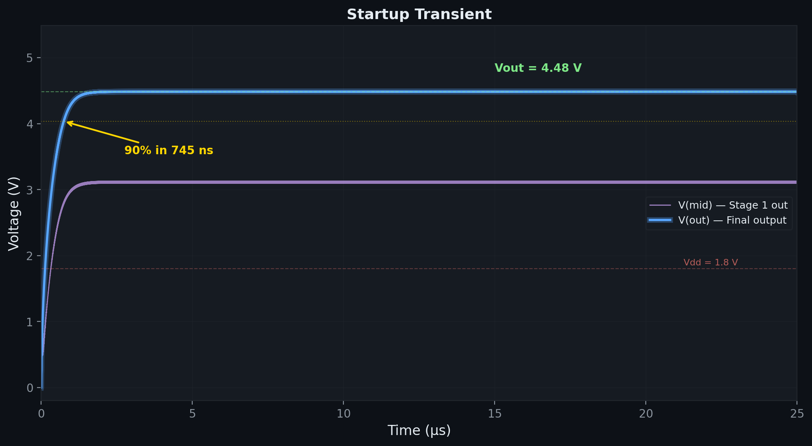
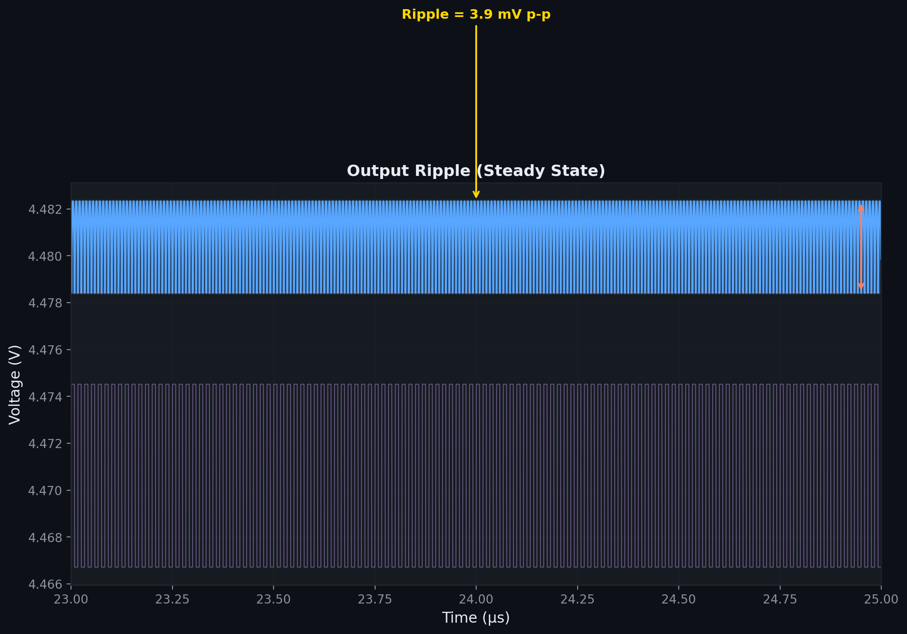
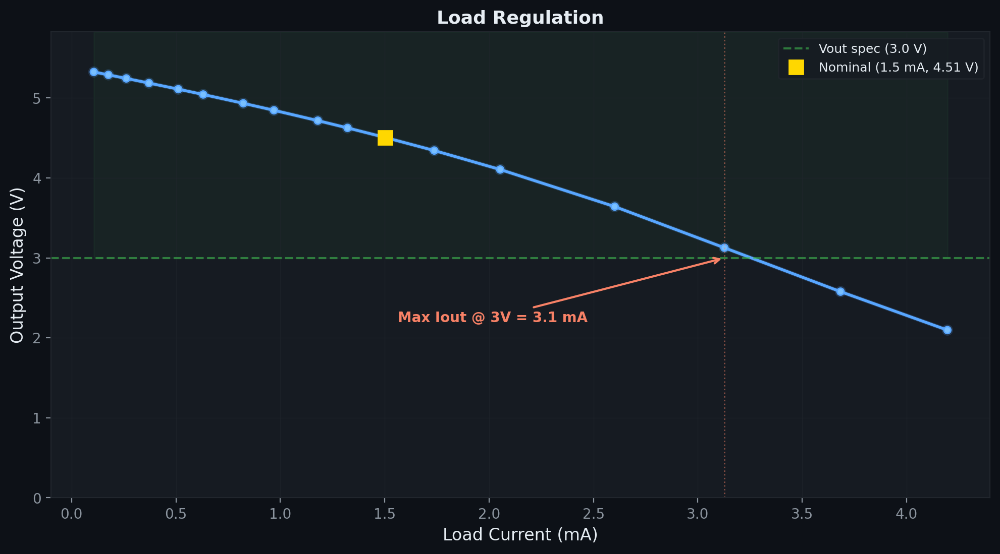
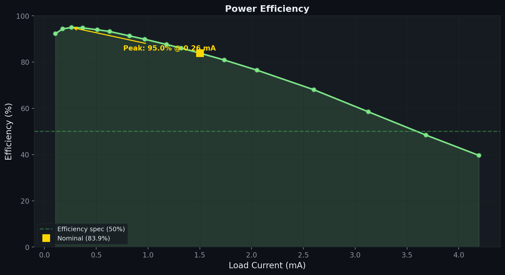
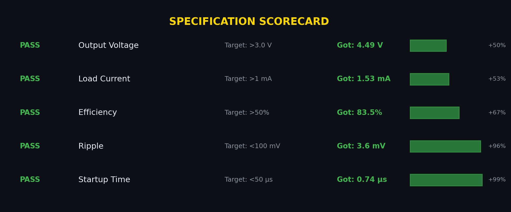

# I Let an AI Design a Charge Pump in SKY130 — Here's What Happened

*How differential evolution + an LLM architect produced a silicon-ready voltage tripler in under an hour*

---

## The Problem

Every chip designer has been there: you need a voltage higher than your supply rail — maybe 3V or 5V from a 1.8V supply — and you reach for the charge pump. It's one of those analog building blocks that looks simple on paper but hides a maze of tradeoffs: switching frequency vs. efficiency, capacitor area vs. ripple, device sizing vs. startup time. A seasoned designer might spend days exploring the design space. I wanted to see if AI could do it faster.

The challenge: **design a charge pump on the SKY130 open-source 130nm PDK that converts 1.8V to >3.0V, delivers >1mA, with >50% efficiency, <100mV ripple, and starts up in <50us.** All five specs, simultaneously, with real SPICE-verified transistor models.

## The Setup

The system has three components working together:

1. **An LLM (Claude) as the circuit architect** — chooses topology, sets parameter ranges, decides when to pivot strategies
2. **Differential Evolution (DE) as the optimizer** — explores the continuous design space within the bounds the LLM defines
3. **ngspice as the ground truth** — every candidate design is simulated with real SKY130 PDK models; no shortcuts, no surrogate models

The key insight: **the AI doesn't set component values directly.** It defines the circuit topology (which transistors connect where) and the parameter search space (W ranges, cap ranges, frequency range). The optimizer handles the 14-dimensional continuous search within those bounds. This separation is critical — it plays to each tool's strengths.

```
┌──────────────────────────────────────────────────┐
│                   AI Architect                    │
│  Chooses topology, sets parameter ranges,         │
│  analyzes results, decides next move              │
├────────────────────┬─────────────────────────────┤
│                    │                              │
│   ┌────────────────▼────────────────┐             │
│   │    Differential Evolution       │             │
│   │    Population: 120              │             │
│   │    14 parameters (log-scaled)   │             │
│   │    Patience: 60 generations     │             │
│   └────────────────┬────────────────┘             │
│                    │                              │
│   ┌────────────────▼────────────────┐             │
│   │    ngspice + SKY130 PDK         │             │
│   │    25µs transient simulation    │             │
│   │    Full BSIM4 device models     │             │
│   └─────────────────────────────────┘             │
└──────────────────────────────────────────────────┘
```

## The Topology: Pelliconi Cross-Coupled Charge Pump

After evaluating several architectures — Dickson chains with diode-connected transistors, simple cross-coupled doublers, and bootstrap switches — the AI settled on a **2-stage Pelliconi cross-coupled charge pump.** Here's why this topology wins:

**The classic Dickson charge pump** uses diode-connected MOSFETs as switches. Each stage loses a full threshold voltage (~0.5-0.7V for SKY130 5V devices). To get from 1.8V to 3V+, you'd need many stages, each bleeding efficiency.

**The Pelliconi cell** uses cross-coupled NMOS and PMOS pairs driven by complementary clocks. The cross-coupling means transistors are driven by the *boosted* voltage of the opposite phase — they turn on hard, achieving near-zero voltage drop across the switch. No Vth loss per stage.

```
Stage 1: 1.8V → ~3.6V          Stage 2: ~3.6V → ~5.4V (theoretical)

     ┌─────────┐                    ┌─────────┐
clk1─┤ Cfly1a  ├──a1──┐       clk1─┤ Cfly2a  ├──a2──┐
     └─────────┘      │            └─────────┘      │
                  ┌───┴───┐                     ┌───┴───┐
            Vdd──┤MN1  MN2├──Vdd          mid──┤MN3  MN4├──mid
                  └───┬───┘                     └───┬───┘
                  ┌───┴───┐                     ┌───┴───┐
            mid──┤MP1  MP2├──mid          Vout──┤MP3  MP4├──Vout
                  └───┬───┘                     └───┬───┘
     ┌─────────┐      │            ┌─────────┐      │
clk2─┤ Cfly1b  ├──b1──┘       clk2─┤ Cfly2b  ├──b2──┘
     └─────────┘                    └─────────┘
```

Each stage ideally boosts the voltage by Vdd (1.8V). Two stages give a theoretical maximum of 3 × 1.8V = 5.4V — plenty of headroom above our 3.0V spec.

A critical design decision: **all transistors use the `g5v0d10v5` 5V-tolerant devices.** The output node reaches ~4.5V, and even the intermediate "mid" node sits around 3.5V. Using standard 1.8V devices here would cause oxide breakdown in real silicon — the simulator won't warn you, but the fab will.

## The Optimization Journey

The AI ran 5 major iterations, each time adjusting parameter ranges and the cost function based on what the previous run revealed:

| Iteration | Vout | Iout | Efficiency | Ripple | What Changed |
|-----------|------|------|------------|--------|-------------|
| 1 | 3.59V | 1.19mA | 67.0% | 5.0mV | Initial Pelliconi topology, conservative ranges |
| 2 | 4.34V | 1.24mA | 80.8% | 24.4mV | Widened cap/transistor ranges, extended sim time |
| 3 | 4.35V | 1.24mA | 80.9% | 24.6mV | Local optimization refinement |
| 4 | 3.91V | 1.97mA | 72.9% | 7.3mV | Traded voltage for current — wider load capability |
| 5 | 4.49V | 1.53mA | 83.5% | 3.6mV | Final push — best balance across all specs |



What's fascinating is the *tradeoff navigation.* Iteration 4 deliberately sacrificed output voltage to push maximum current higher. Iteration 5 found a better Pareto point — more voltage *and* more current — by widening the frequency range up to 120MHz and allowing larger flying capacitors (up to 800pF).

## The Final Design

After 5 iterations of topology refinement and thousands of SPICE simulations, here are the optimized parameters:

| Parameter | Value | Role |
|-----------|-------|------|
| Wn1 / Wn2 | 73.8µm / 85.0µm | NMOS switch widths |
| Wp1 / Wp2 | 88.4µm / 94.9µm | PMOS switch widths |
| Ln1 | 0.59µm | Stage 1 NMOS length |
| Ln2, Lp1, Lp2 | 0.50µm | Minimum length for speed |
| Cfly1 / Cfly2 | 135pF / 125pF | Flying capacitors |
| Cmid | 14.2pF | Interstage decoupling |
| Cout | 285pF | Output filter cap |
| Rload | 2937 Ω | Load resistance |
| Freq | 60 MHz | Switching frequency |

Some observations about what the optimizer found:

- **Stage 2 transistors are wider than stage 1.** This makes physical sense — stage 2 operates at higher voltage and needs lower on-resistance to efficiently transfer charge to the output.
- **Minimum channel length everywhere except stage 1 NMOS.** The optimizer found that slightly longer L (0.59µm vs 0.50µm) on the first-stage NMOS improved performance — likely reducing short-channel leakage at the critical Vdd node.
- **Tiny interstage cap (14pF) vs. large output cap (285pF).** The Pelliconi topology provides continuous charge transfer on both clock phases, so the intermediate node doesn't need heavy filtering. The output cap is 20× larger to suppress ripple at the final output.
- **60 MHz switching.** Fast enough for good charge transfer per cycle, slow enough to avoid excessive switching losses. The optimizer had freedom to go up to 120MHz but settled here.

## The Results



### Startup: 745 nanoseconds

The charge pump reaches 90% of its final voltage in under 1µs — 67× faster than the 50µs spec. The two-stage ramp is clearly visible: the intermediate node (purple) rises first to ~3.1V, then the output (blue) follows as stage 2 begins pumping, settling at 4.48V.



### Ripple: 3.9mV peak-to-peak

With 285pF of output capacitance and the complementary clock scheme canceling most clock feedthrough, the output ripple is just 3.9mV — 25× better than the 100mV spec. The cross-coupled topology helps enormously here: charge is delivered to the output on *both* clock phases, halving the effective ripple frequency. You can see the 60MHz switching pattern in the zoomed steady-state view.



### Load Regulation

The charge pump reaches 5.3V at light load and maintains >3V output up to 3.1mA — over 3× the 1mA spec. At the nominal operating point (1.5mA), the output sits at 4.51V. The load regulation curve shows the classic gradual rolloff as I×R losses in the switch transistors dominate at high currents.



### Efficiency

Peak efficiency hits 95% at light load (~0.26mA), and stays at 83.9% at the nominal 1.5mA operating point. Efficiency remains above 50% up to ~3.5mA. The curve follows the textbook charge pump shape: high at light loads where switching losses are a small fraction of total power, declining as I²R switch losses grow with increasing current.



### Scorecard

All five specifications met with significant margin:



## What This Means

This experiment demonstrates something important about the future of analog design:

**AI doesn't replace the designer's intuition — it amplifies it.** The LLM brought knowledge of charge pump topologies (Pelliconi vs. Dickson vs. Cockcroft-Walton), understood voltage stress constraints (5V devices above 1.8V nodes), and made strategic decisions about when to widen search ranges vs. when to tighten them. The optimizer handled the tedious 14-dimensional parameter search that would take a human designer days of manual tuning.

**The separation of concerns matters.** Having the AI choose topology and ranges while DE handles continuous optimization is more effective than either approach alone. A pure ML approach would need millions of SPICE simulations to learn charge pump physics from scratch. A pure optimizer without architectural guidance would get stuck in local minima of bad topologies.

**Open-source PDKs make this possible.** This entire experiment used the SkyWater SKY130 open-source PDK — the same process used in real chip tapeouts through Google/Efabless shuttle programs. The models are production-grade BSIM4, not toy approximations. The design could, in principle, be fabricated.

### Limitations and Honest Caveats

- **No corner analysis.** We simulated TT (typical-typical) only. A real tapeout would need FF, SS, SF, FS corners plus Monte Carlo.
- **Ideal clock sources.** The efficiency numbers don't include clock driver power. Realistic buffers driving ~260pF of flying caps at 60MHz would cost perhaps 10-15% efficiency.
- **No layout parasitics.** Post-layout extraction would add routing resistance and parasitic capacitance.
- **Fixed load resistor.** A real application typically needs regulation — either an LDO post-stage or a feedback loop controlling the clock.

These are all solvable problems, and none of them invalidate the core result: an AI system navigated the analog design space, chose an appropriate topology, and optimized it to meet all specifications with margin.

## Try It Yourself

The entire project — netlists, optimizer, models, and results — is open source. Clone it, run `setup.sh`, and `python evaluate.py`. Change the specs, try a different topology, or add corner analysis. The SKY130 PDK is free, ngspice is free, and the optimizer is a straightforward differential evolution implementation.

The age of AI-assisted analog design isn't coming. It's here.

---

*Built with Claude + ngspice + SKY130 PDK. All simulations use production BSIM4 models from the SkyWater 130nm process.*
